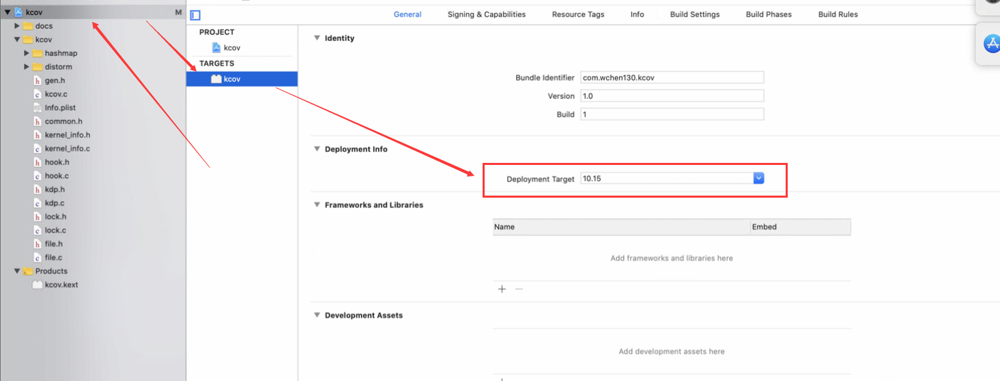
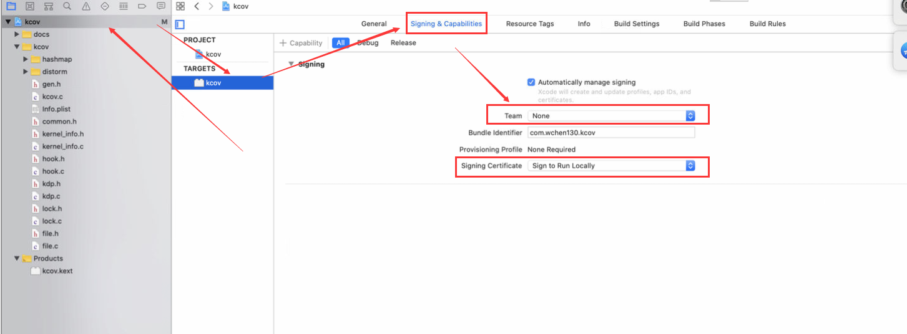

# SyzGen 实验复现踩坑指南

## 一、实验链接

[SyzGen_setup - github](https://github.com/seclab-ucr/SyzGen_setup)

## 二、先决条件

1. 准备一个 **intel** MacOS 10.15.7 虚拟机，且满足以下条件：

   1. 可以支持 lldb 双机调试

   2. 已关闭 SIP，可以加载无效签名的 kext

2. 务必准备一个 IDA (version <= 7.3)，**不要 version >= 7.4 的**
3. 准备 XCode.app

## 三、环境搭建

### 1. 基础环境

跑 `SyzGen_setup/setup.sh` 安装环境。环境安装完成后，后续跑任何 python 脚本时都必须先

```shell
source SyzGen_setup/fuzz/bin/activate
```

以启用 python 虚拟环境。

### 2. VM 环境

照着 `SyzGen_setup/SyzGen/docs/setup_vm.md` 配置 VM。主要配置几点：

1. 配置双机调试环境，并替换 kernel 为 development 版本
2. 配置 MacOS 远程登录 ssh，并设置 authorized_keys 允许无密码登录
3. 配置 sudo 实现无密码
4. 创建 syzgen config
5. VM CPU 个数最好是 1个，以提高双机调试的稳定性。

### 3. kcov

> README 位于 `SyzGen_setup/kcov/docs/README.md`。

kcov.kext 在运行 syzkaller 时提供代码覆盖率检测，因此需要对其进行编译，步骤如下：

1. 运行 `SyzGen_setup/kcov/scripts/parse.py` 并指定 VM 内核路径：

   > 注意别忘了这里指定的是，**先前新替换上去的 VM kernel.development 的路径**。
   >
   > 通常这个会在 KDK 中有，没有的话就 scp 从 VM 中复制一个进 host 中再指定。

   ```shell
   python parse.py /path/to/kernel
   ```

   这一步将查询指定的 kernel 文件中的一些偏移量，并生成 `gen.h` 供 kcov.kext 使用，因此 **VM kernel path一定不要错**。

2. 使用 XCode 打开 kcov.xcodeproj

3. 修改 target 的 Deployment Info 为 10.15：

   

4. 去掉无用的认证信息：

   

5. 之后编译，生成 kcov.kext。**将其拷贝进 VM 中的 HOME 路径下**（即 `~`）。

   > 因为 syzkaller 会直接执行 `sudo kextload kcov.kext` 加载驱动，而 ssh 默认工作目录为 Home 目录。

按照上述步骤，kcov.kext 就可以成功编译出来。但是**别先急着 kextload 上去**。

kcov 的局限性在于**一个 kcov 只能检测一个 driver 的覆盖率，无法同时检测多个 driver 的覆盖率**。

接下来我们还需要生成一个 kcov 文件，用于 kcov.kext 读取基本块首地址下断点使用：

1. 使用 `SyzGen_setup\kcov\scripts\ida_cov_wrap.py` 的 `--path` 指定某个 kext，以生成中间文件 `cov.json`。这里我扩展了一下脚本，使其支持批量生成中间文件 `cov.json`（`--folder` 参数），同时还自动填充 json 中那些需要手动填写的字段。以下是其 diff：

   ```diff
   diff --git a/kcov/scripts/ida_cov_wrap.py b/kcov/scripts/ida_cov_wrap.py
   index 07ebbc2..0a10f50 100644
   --- a/kcov/scripts/ida_cov_wrap.py
   +++ b/kcov/scripts/ida_cov_wrap.py
   @@ -1,19 +1,65 @@
   
    import os
    import argparse
   +import shutil
   +import json
   +import biplist # plist library
    import subprocess
   
   -IDA64 = "C:\\Program Files\\IDA 7.2\\idat64.exe"
   +IDA64 = "D:\software\CrackingTools\[P.Y.G]IDA_Pro_7.5_SP3\ida64.exe"
   +
   +def run(kextpath):
   +    if not kextpath.endswith(".kext"):
   +        print("skip %s" % kextpath)
   +        return
   +    contents_path = os.path.join(kextpath, "Contents")
   +    macos_path = os.path.join(contents_path, "MacOS")
   +    try:
   +        bins = os.listdir(macos_path)
   +    except FileNotFoundError:
   +        return
   +    assert len(bins) == 1
   +    filepath = os.path.join(macos_path, bins[0])
   
   -def run(filepath):
        script = os.path.join(os.getcwd(), "scripts", "ida_cov.py")
   +    print(filepath)
        subprocess.run([IDA64, "-A", "-S\"%s\"" % script, filepath, "-t"], check=True)
   -    # cov = os.path.join(os.path.dirname(filepath), "cov.json")
   -    # dst = os.path.join("workdir", "cc", f)
   -    # os.replace(cov, "cov.json")
   +
   +    # read generated json
   +    src = os.path.join(macos_path, "cov.json")
   +    with open(src, "r") as f:
   +        json_content = json.load(f)
   +    os.remove(src)
   +    os.remove(filepath+".i64")
   +
   +    # set some fields
   +    json_content["binary"] = kextpath
   +
   +    plist = biplist.readPlist(os.path.join(contents_path, "Info.plist"))
   +    json_content["kext"] = plist["CFBundleIdentifier"]
   +
   +    # save json
   +    dst = os.path.join("workdir", os.path.basename(kextpath)+".json")
   +
   +    dst_dir = os.path.dirname(dst)
   +    if not os.path.exists(dst_dir):
   +        os.mkdir(dst_dir)
   +
   +    with open(dst, "w") as f:
   +        json.dump(json_content, f)
   
    if __name__ == "__main__":
        parser = argparse.ArgumentParser(prog="main")
   -    parser.add_argument("--path", help="path to the binary")
   +    parser.add_argument("--path", help="path to the kext")
   +    parser.add_argument("--folder", help="path to the kexts")
        args = parser.parse_args()
   -    run(args.path)
   +
   +    if args.path:
   +        print("run")
   +        run(args.path)
   +    elif args.folder:
   +        print("group_run")
   +        fileAll = os.listdir(args.folder)
   +        for file in fileAll:
   +            absolutePath = os.path.join(args.folder, file)
   +            run(absolutePath)
   ```

2. 最核心的 idapython 脚本为 `SyzGen_setup\kcov\scripts\ida_cov.py`，但这里同样有个地方需要修复：

   ```diff
   diff --git a/kcov/scripts/ida_cov.py b/kcov/scripts/ida_cov.py
   index 0d5f0e3..7fba25e 100644
   --- a/kcov/scripts/ida_cov.py
   +++ b/kcov/scripts/ida_cov.py
   @@ -27,17 +27,17 @@ for i in range(len(funcs)-1):
        uncover += getBlocks(funcea, funcs[i+1])
   
    # print("func at 0x%x" % funcs[-1])
    uncover += getBlocks(funcs[-1], idc.SegEnd(funcs[-1]))
   
   -info = []
   -info.append({
   +info = {
        "uncover": uncover,
        "cover": [],
        "kext": "",
        "binary": ""
   -})
   +}
   
    with open("cov.json", "w") as fp:
   -    json.dump({"info": info}, fp)
   +    json.dump(info, fp)
   +    # json.dump({"info": info}, fp)
   
    Exit(0)
   \ No newline at end of file
   ```

   这个脚本先前我是把它适配成高版本 ida 7.7 跑的，以下是转换后的脚本。不过如果按照先前说的 version <= 7.3 版本的 ida ，那就只需 patch 上面那个 diff 即可。

   ```python
   from idautils import *
   from idaapi import *
   from idc import *
   from ida_pro import *
   
   import json
   
   idaapi.auto_wait()
   
   image_base = idaapi.get_imagebase()
   
   def getBlocks(start, end):
       ret = []
       for block in idaapi.FlowChart(idaapi.get_func(funcea)):
           if start <= block.start_ea < end and is_code(get_full_flags(block.start_ea)):
               # print(hex(block.startEA))
               ret.append(block.start_ea)
       return ret
   
   uncover = []
   funcs = list(Functions())
   for i in range(len(funcs)-1):
       funcea = funcs[i]
       if idc.get_segm_name(funcea) != "__text":
           continue
       # print("func at 0x%x" % funcea)
       uncover += getBlocks(funcea, funcs[i+1])
   
   # print("func at 0x%x" % funcs[-1])
   uncover += getBlocks(funcs[-1], idc.get_segm_end(funcs[-1]))
   
   info = {
       "uncover": uncover,
       "cover": [],
       "kext": "",
       "binary": ""
   }
   
   with open("cov.json", "w") as fp:
       json.dump(info, fp)
       # json.dump({"info": info}, fp)
   
   qexit(0)
   ```

3. 之后待生成出 `cov.json` 后，**注意，一定要打开该文件并手动对 json 文件中的 kext 字段进行填写，将当前 driver 的 bundle ID 写入至 `kext` 字段中**。例如：

   ```json
   {"uncover": [1764, 1814, ..., 84434], "cover": [], "kext": "com.apple.iokit.IONetworkingFamily", "binary": "IONetworkingFamily.kext"}
   ```
   
   kcov.kext 会使用到这个 bundle ID 来找到待跟踪的驱动基地址，因此 cov.json 中的 kext 字段相当的重要！
   
4. 最后，运行 `SyzGen_setup\kcov\scripts\gen_cov.py` 以生成 `kcov` 文件。

   ```shell
   python gen_cov.py -o kcov cov.json
   ```

待 kcov.kext 和 kcov 文件两个都准备好后，就可以开始做测试：

1. 将 kcov 复制进虚拟机中的 `/tmp/kcov` **（路径一个字都不能错）**
2. `sudo kextload kcov.kext` 装载 kcov

> 注意，**上面的顺序一步都不能错**，同时 kcov.kext 也是**依赖先前所指定的 kernel path**，因此不能在不同 VM 上来回传输使用。
>
> 否则，就会导致 kcov.kext 装载失败，报错 `kcov.kext failed to load - (libkern/kext) not found; check the system/kernel logs for errors or try kextutil(8).`。这种报错使用 `kextutil -v` 也看不到详细报错信息。
>
> 这是因为 `kcov.kext` 在执行 `kcov_start` 时，由于没有找到 `/tmp/kcov`，因此无法下断点，直接退出。
>
> 另外，想看 log 可以使用 `sudo dmesg` 查看，要是没有 log 则多装载几次 `kcov.kext`。

### 4. hook

> README 位于 `SyzGen_setup/macOS-tools/README.md`。

`SyzGen_setup/macOS-tools` 中的 kext 用于收集特定 IOKit 的调用 traces，主要是使用 inline hook 技术来实现。

hook.kext 的编译过程和 kcov 相同，请参照上面的内容完成编译。在编译前同样需要运行 python 脚本生成 `gen.h` 以供 hook.kext 编译使用：

```shell
cp SyzGen_setup/SyzGen/libs/demumble SyzGen_setup/macOS-tools/script
cd SyzGen_setup/macOS-tools/script

python gen.py --kext bundle_id_of_target_driver --clazz name_of_target_user_client
# 例如 python gen.py --clazz IONetworkUserClient --kext com.apple.iokit.IONetworkingFamily --binary ~/Desktop/vmmacos/Extensions/IONetworkingFamily.kext/Contents/MacOS/IONetworkingFamily
```

> 注意，**三个参数不能有任何错误**，否则 hook.kext 将无法被装载进 kernel 中。（我就吃了这个大亏）

然后进入 `SyzGen_setup/macOS-tools/client` 中执行一下 make，将 hook.kext 对应的 client 编译出来。

之后将 hook.kext 和 client 均复制进 VM 中，再将 hook.kext 装载进 kernel 中，装载完成后执行 client 以收集 traces，收集结果将放在 `/tmp/kernel_hook.txt` 中。

> 如果 hook.kext 无法安装进系统中，则需要看看先前执行的 gen.py 传入的参数是否出现了错误。

### 5. SyzGen

> 接下来是重头戏，一堆坑。

#### a. idapython

- `SyzGen_setup\SyzGen\scripts\ida_getcc.py`。这个脚本用于收集函数签名，**只能用 version <= 7.3 的 IDA 运行**。

  若将其 python 接口转换为 IDA 7.7 的 ida python 接口，则会在运行时产生错误，因此这里只是简单的将 python 版本从 2 迁移到了 3：

  ```diff
  diff --git a/SyzGen/scripts/ida_getcc.py b/SyzGen/scripts/ida_getcc.py
  index 31201ba..42f1a82 100644
  --- a/SyzGen/scripts/ida_getcc.py
  +++ b/SyzGen/scripts/ida_getcc.py
  @@ -27,8 +27,13 @@ builtinTypeSet.add("bool")
   builtinTypeSet.add("void")
   builtinTypeSet.add("task")
  
  +'''
  +    Kiprey Note: 这个脚本只能在低于 IDA7.4 的版本使用
  +    将其转换成高版本的 idapy 脚本会产生错误
  +'''
  +
   def log(message):
  -    print message
  +    print (message)
  
   def parseDemangledFuncNameToGetClassNameAndArglist(demangledFuncName, isVirtual):
       arglist = []
  @@ -230,7 +235,7 @@ def parseModInitFuncSeg():
           classParentMetaClass = None
           classParentClass = None
  
  -        print "modInitFuncName: " + str(modInitFuncName)
  +        print ("modInitFuncName: " + str(modInitFuncName))
           for (startea, endea) in Chunks(modInitFuncEA):
               heads = list(Heads(startea, endea))
               for i in range(0, len(heads)):
  @@ -255,7 +260,7 @@ def parseModInitFuncSeg():
                               classParentMetaClass =  Demangle(valueName, GetLongPrm(INF_SHORT_DN))
                               if classParentClass:
                                   classParentClass = classParentMetaClass[:classParentMetaClass.rfind("::")]
  -                    print className, classParentClass, classSize
  +                    print (className, classParentClass, classSize)
  
                       # Add class struct or fulfill existing class struct
                       classNameToParentNameMap[className] = classParentClass
  @@ -273,7 +278,7 @@ def processFuncArgs(funcEA, isVirtual, className):
       demangledFuncName = Demangle(funcName, GetLongPrm(INF_LONG_DN))
       classNameInFuncName, arglist = parseDemangledFuncNameToGetClassNameAndArglist(demangledFuncName, isVirtual)
  
       if (isVirtual and classNameInFuncName == className) or ( (not isVirtual) and classNameInFuncName != None ):
  -        print "Parsing Args For Func " + funcName
  +        print ("Parsing Args For Func " + funcName)
           funcType = getFuncTypeByArgList(arglist)
           funcTypeArgStartLoc = funcType.find("(")
           demangledFuncNameWithoutArgs = demangledFuncName[:demangledFuncName.find("(")].strip()
  @@ -326,11 +331,11 @@ def parseGOTNames():
   def main():
       parseGOTNames()
       preparePredefinedStructNameToIdMap()
  -    print "[+] Parse ModInitFunc Segments"
  +    print ("[+] Parse ModInitFunc Segments")
       parseModInitFuncSeg()
  -    print "[+] Parse VTables"
  +    print ("[+] Parse VTables")
       parseVTables()
  -    print "[+] Process All Function Args"
  +    print ("[+] Process All Function Args")
       processAllFuncArgs()
       # hideAllStructs()
  ```

- `SyzGen_setup\SyzGen\scripts\ida.py`：`ida_getcc.py` 的 wrapper。改了一处小小的代码：

  ```diff
  diff --git a/SyzGen/scripts/ida.py b/SyzGen/scripts/ida.py
  index 2791af3..86c67cb 100644
  --- a/SyzGen/scripts/ida.py
  +++ b/SyzGen/scripts/ida.py
  @@ -65,7 +65,7 @@ def getInfo(path):
  
   def analyze_signature(filepath):
       d, f = os.path.split(filepath)
  -    # cc = os.path.join(d, "cc.json")
  +    cc = os.path.join(d, "cc.json")
       dst = os.path.join("workdir", "cc", f)
       if os.path.exists(dst):
           return
  @@ -77,7 +77,7 @@ def analyze_signature(filepath):
       print(" ".join(cmd))
       subprocess.run(cmd, check=True)
  
  -    os.replace("cc.json", dst)
  +    os.replace(cc, dst)
  
   def run(path):
       for name in os.listdir(path):
  ```

#### b. lldb script

`SyzGen_setup/SyzGen/debug.py` 是 lldb 执行时将会读入解析的 python script，主要用于与 python lldb proxy 进行通信。可能是因为 lldb 版本问题，其中存在一些错误：

> 执行注册进的 lldb 命令时，会提示 `lldb.target` 不存在，以及 `load_addr` 使用方式错误。

以下是修复的 patch：

```diff
diff --git a/SyzGen/debug.py b/SyzGen/debug.py
index 692803d..5e8c020 100644
--- a/SyzGen/debug.py
+++ b/SyzGen/debug.py
@@ -66,7 +66,7 @@ class LLDBDebugger(object):

     def get_current_thread(self):
         # TODO: GetThreadAtIndex(3)???
-        process = lldb.target.GetProcess()
+        process = lldb.debugger.GetSelectedTarget().GetProcess()
         if process.GetNumThreads() > 1:
             print("More than one thread")
         thread = process.GetThreadAtIndex(0)
@@ -121,7 +121,7 @@ class LLDBDebugger(object):
     def read_memory(self, address, nbytes, **kwargs):
         print("read memory at 0x%x with %d" % (address, nbytes))
         error = lldb.SBError()
-        process = lldb.target.GetProcess()
+        process = lldb.debugger.GetSelectedTarget().GetProcess()
         content = process.ReadMemory(address, nbytes, error)
         if error.Success():
             return bytearray(content)
@@ -130,7 +130,7 @@ class LLDBDebugger(object):
     def write_memory(self, address, value, *args, **kwargs):
         print("write memory at 0x%x" % address, value)
         error = lldb.SBError()
-        process = lldb.target.GetProcess()
+        process = lldb.debugger.GetSelectedTarget().GetProcess()
         new_value = str(value)  # FIXME: pthon2 style
         result = process.WriteMemory(address, new_value, error)
         if not error.Success():
@@ -187,14 +187,15 @@ class LLDBDebugger(object):

     def find_function_addr(self, name):
         ret = []
-        for each in lldb.target.FindFunctions(name):
+        target = lldb.debugger.GetSelectedTarget()
+        for each in target.FindFunctions(name):
             if not each.block.IsInlined():
-                addr = each.symbol.addr.load_addr
+                addr = each.symbol.addr.GetLoadAddress(target)
                 ret.append({"inlined": False, "addr": addr})
                 # print(each.symbol.name, hex(addr))
             else:
                 for start, end in each.block.ranges:
-                    ret.append({"inlined": True, "start": start.load_addr, "end": end.load_addr})
+                    ret.append({"inlined": True, "start": start.GetLoadAddress(target), "end": end.GetLoadAddress(target)})
                     # print("[inlined]", hex(start.load_addr), hex(end.load_addr))
         if len(ret) == 0:
             raise Exception("Cannot find the symbol %s" % name)
@@ -202,10 +203,10 @@ class LLDBDebugger(object):

     def find_function_name(self, addr):
         print("find function at 0x%x" % addr)
-        return lldb.target.ResolveLoadAddress(addr).symbol.name
+        return lldb.debugger.GetSelectedTarget().ResolveLoadAddress(addr).symbol.name

     def find_global_variable(self, name):
-        var = lldb.target.FindFirstGlobalVariable(name)
+        var = lldb.debugger.GetSelectedTarget().FindFirstGlobalVariable(name)
         if var and var.value:
             return int(var.value, 16)
         raise Exception("Cannot find the global variable: %s" % name)
@@ -227,7 +228,7 @@ class LLDBDebugger(object):
             elapsed = 0
             print("ready to check!")
             while elapsed <= timeout:
-                process = lldb.target.GetProcess()
+                process = lldb.debugger.GetSelectedTarget().GetProcess()
                 if process.GetState() == lldb.eStateStopped:
                     break

@@ -243,7 +244,7 @@ class LLDBDebugger(object):
                 break
             else:
                 print("different thread!!")
-                lldb.target.GetProcess().Continue()
+                lldb.debugger.GetSelectedTarget().GetProcess().Continue()
                 time.sleep(2)

     @run_async
@@ -255,7 +256,8 @@ class LLDBDebugger(object):
         # TODO: Check if it was hit at desired breakpoint
         # Make sure the process is stopped
         # target = debugger.GetSelectedTarget()
-        process = lldb.target.GetProcess()
+        # raise Exception
+        process = lldb.debugger.GetSelectedTarget().GetProcess()
         if not process.IsValid():
             print("process is invalid")
             return False
@@ -281,7 +283,7 @@ class LLDBDebugger(object):
         return self.get_current_thread().GetThreadID()

     def remove_breakpoints(self):
-        lldb.target.DeleteAllBreakpoints()
+        lldb.debugger.GetSelectedTarget().DeleteAllBreakpoints()
         return True

     def set_breakpoint(self, kext, target):
@@ -354,13 +356,14 @@ class Fuzz(LLDBCommand):
                 break

     def getFuncAddr(self, name):
-        for each in lldb.target.FindFunctions(name):
+        target = lldb.debugger.GetSelectedTarget()
+        for each in target.FindFunctions(name):
             if not each.block.IsInlined():
-                addr = each.symbol.addr.load_addr
+                addr = each.symbol.addr.GetLoadAddress(target)
                 print(each.symbol.name, hex(addr))
             else:
                 for start, end in each.block.ranges:
-                    print("[inlined]", hex(start.load_addr), hex(end.load_addr))
+                    print("[inlined]", hex(start.GetLoadAddress(target)), hex(end.GetLoadAddress(target)))

     def findKext(self, addr):
         if addr.startswith("0x"):
```

这些错误之所以会发生，是因为 `lldb.target` 只能在 lldb script 交互式使用。

> 但是有时候就又可以，这就有点迷惑，大概率 lldb.target 的使用是有条件的，不太稳定容易报错。

#### c. syzkaller config

> `SyzGen_setup\SyzGen\syzgen\parser\generate.py`

这里需要修改一下 syzkaller config 生成部分的代码，重新指定一下本机的 ssh key path：

```diff
diff --git a/SyzGen/syzgen/parser/generate.py b/SyzGen/syzgen/parser/generate.py
index a4b3e5d..35efbb5 100644
--- a/SyzGen/syzgen/parser/generate.py
+++ b/SyzGen/syzgen/parser/generate.py
@@ -596,7 +596,7 @@ def generateConfig(client):
         "target": "darwin/amd64",
         "http": "127.0.0.1:56741",
         "workdir": os.path.join(getConfigKey("syzkaller"), "workdir"),
-        "sshkey": "/Users/CwT/.ssh/id_rsa",
+        "sshkey": "/Users/test/.ssh/id_rsa",
         "ssh_user": getConfigKey("user") if client.access else "root",
         "syzkaller": getConfigKey("syzkaller"),
         "reproduce": False,
```

#### d. lldb proxy

> `SyzGen_setup\SyzGen\syzgen\debugger\lldbproxy.py`

lldb proxy 是 python 端用于与 lldb 通信的一段代码。其中有两个地方需要修改：

1. 在执行 kdp-remote attach 远程 kernel 前，在 lldb 中运行：

   ```shell
   settings set target.load-script-from-symbol-file true
   ```

   使得 lldb 自动加载 kernel 所附带的 KDK python script。

   **注意这个 KDK python script 非常的重要**，因为 debug.py 中会用到关于 kernel debugging 相关的 lldb 命令。

2. syzgen 触发 VM 断点所使用的命令是

   ```shell
   sudo dtrace -w -n "BEGIN { breakpoint(); }"
   ```

   VM 执行该命令时将会断下，以待 lldb attach 上去。

   但是**该命令并非百分百能起作用**，倘若先前触发断点的代码不起作用，则这里 kdp-remote 一定会失败。因此需要额外处理一下，检测 attach 是否成功，如果不成功则重新触发断点并再次尝试 attach。

以下是该文件针对该问题所打上的 patch

```diff
diff --git a/SyzGen/syzgen/debugger/lldbproxy.py b/SyzGen/syzgen/debugger/lldbproxy.py
index a319b27..e05f0e4 100644
--- a/SyzGen/syzgen/debugger/lldbproxy.py
+++ b/SyzGen/syzgen/debugger/lldbproxy.py
@@ -163,42 +163,68 @@ class LLDBDebugger(Thread):
     def run(self):
         try:
             logger.debug("spawn lldb")
-            lldb = pexpect.spawn("lldb %s" % self.kernel, timeout=30)
+            cmd = "lldb %s" % self.kernel
+            print(cmd)
+            lldb = pexpect.spawn(cmd, timeout=30)
             lldb.expect("\\(lldb\\)")
             # lldb.expect("\\(lldb\\)")
             outs = lldb.before
-            print(outs)
+            print(outs.decode("latin"))

             # For unknown reason, we have to invoke 'script' in advance.
             lldb.sendline("script")
             lldb.expect(">>>")
             outs = lldb.before
-            print(outs)
+            print(outs.decode("latin"))

             lldb.sendline("quit()")
             lldb.expect("\\(lldb\\)")
-            print(lldb.before)
+            print(lldb.before.decode("latin"))
             # lldb.expect("\\(lldb\\)")
             # print(lldb.before)

             lldb.sendline("command script import %s" % os.path.join(os.getcwd(), "debug.py"))
             lldb.expect("\\(lldb\\)")
-            print(lldb.before)
+            print(lldb.before.decode("latin"))
             # lldb.expect("\\(lldb\\)")
             # print(lldb.before)

             ip = getConfigKey("ip")
             logger.debug("kdp-remote %s" % ip)
-            lldb.sendline("kdp-remote %s" % ip)
-            lldb.expect("stopped")
-            print(lldb.before)
+            lldb.sendline("settings set target.load-script-from-symbol-file true")
+
+            # Kiprey NOTE: NMI 的方法并不稳定，间隔失效，因此需要在失效时重新触发断点
+            retry = True
+            while retry:
+                # 尝试 attach kernel
+                retry = False
+                try:
+                    lldb.sendline("kdp-remote %s" % ip)
+                    lldb.expect("stopped", timeout=3)
+                except pexpect.TIMEOUT:
+                    retry = True
+                    logger.debug("kdp attach failed, retrying...")
+                    # 如果没 attach 上，则尝试重试
+                    try:
+                        subprocess.run(["ssh", getRemoteAddr(), "sudo dtrace -w -n \"BEGIN { breakpoint(); }\""], timeout=3)
+                    except subprocess.TimeoutExpired:
+                        pass
+
+            # lldb.sendline("kdp-remote %s" % ip)
+            # lldb.expect("stopped")
+
+            print(lldb.before.decode("latin"))

             logger.debug("proxy -c")
             lldb.sendline("proxy -c")

             while not self.stop:
                 lldb.expect([pexpect.TIMEOUT, pexpect.EOF], timeout=1)
+            print(lldb.before.decode("latin"))
             logger.debug("return from proxy -c")
+        except pexpect.TIMEOUT:
+            # for debug use only
+            print(lldb.before.decode("latin"))
+            print("pexpect.TIMEOUT triggered!")
         finally:
             lldb.close()
             lldb.terminate(force=True)
```

#### e. wait breakpoints

SyzGen 中有较多这样的代码：

1. 在 VM 中执行某个程序
2. 等待该程序触发 lldb 断点，使得整个 OS 停止

思路看上去没啥问题。但问题是，实现第一步所使用的方法为 `subprocess.run`，该方法的功能是**执行程序直到程序返回**（和 `subprocess.Popen` 不同）。

因此如果在执行该程序时触发 kernel 断点，那么 `subprocess.run` 是永远无法返回的，因为 OS 已经卡住了，正在执行的程序同样也卡住不会继续执行，所以 ssh 也同样会卡住，整个 syzgen 没法执行下去了。

解决这样的问题很简单，给这类 `subprocess.run` 方法调用加个 `timeout` 属性，然后 try catch 掉超时异常即可。

以下是打上的 patch：

- `SyzGen_setup\SyzGen\syzgen\analysis\dispatch.py`

  ```diff
  diff --git a/SyzGen/syzgen/analysis/dispatch.py b/SyzGen/syzgen/analysis/dispatch.py
  index 8d85a1d..1a21d86 100644
  --- a/SyzGen/syzgen/analysis/dispatch.py
  +++ b/SyzGen/syzgen/analysis/dispatch.py
  @@ -489,10 +489,13 @@ def _find_dispatchTable(proxy, binary, kext, service, client, no_mem=False):
               proxy.clear()
  
               # run poc
  -            if client.access:
  -                subprocess.run(["ssh", remote_addr, "~/poc"])
  -            else:
  -                subprocess.run(["ssh", remote_addr, "sudo ~/poc"])
  +            try:
  +                if client.access:
  +                    subprocess.run(["ssh", remote_addr, "~/poc"], timeout=2)
  +                else:
  +                    subprocess.run(["ssh", remote_addr, "sudo ~/poc"], timeout=2)
  +            except subprocess.TimeoutExpired:
  +                pass
               logger.debug("execute the PoC in guest")
  
               # TODO: check inputs to make sure it is the correct one.
  ```

- `SyzGen_setup\SyzGen\syzgen\analysis\dynamic.py`

  ```diff
  diff --git a/SyzGen/syzgen/analysis/dynamic.py b/SyzGen/syzgen/analysis/dynamic.py
  index 01ae145..50429ed 100644
  --- a/SyzGen/syzgen/analysis/dynamic.py
  +++ b/SyzGen/syzgen/analysis/dynamic.py
  @@ -100,7 +100,10 @@ def _find_client(proxy, binary, kext, service, root=False):
               proxy.clear()
  
               # run PoC
  -            check_effect_service(service.metaClass, runInVM=True, root=root)
  +            try:
  +                check_effect_service(service.metaClass, runInVM=True, root=root, timeout=2)
  +            except subprocess.TimeoutExpired:
  +                pass
               # subprocess.run(["ssh", getRemoteAddr(), "~/testService %s 0" % service.metaClass])
               logger.debug("execute testService %s 0" % service.metaClass)
  ```

- `SyzGen_setup\SyzGen\syzgen\analysis\infer.py`

  ```diff
  diff --git a/SyzGen/syzgen/analysis/infer.py b/SyzGen/syzgen/analysis/infer.py
  index f97b6da..02d4c2c 100644
  --- a/SyzGen/syzgen/analysis/infer.py
  +++ b/SyzGen/syzgen/analysis/infer.py
  @@ -1205,8 +1207,11 @@ def execute(proxy, binary, kext, service, client, index, syscall, isConcolic, ma
       try:
           remote_addr = getRemoteAddr()
           if not manual:
  -            subprocess.run(["ssh", remote_addr, "sudo dtrace -w -n \"BEGIN { breakpoint(); }\""])
  -            time.sleep(10)  # wait 10s to make it into effect
  +            try:
  +                subprocess.run(["ssh", remote_addr, "sudo dtrace -w -n \"BEGIN { breakpoint(); }\""], timeout=3)
  +            except subprocess.TimeoutExpired:
  +                pass
  +            # time.sleep(10)  # wait 10s to make it into effect
               logger.debug("suspend VM")
  
               # launch the debugger to connect kernel and our server.
  @@ -1231,10 +1236,13 @@ def execute(proxy, binary, kext, service, client, index, syscall, isConcolic, ma
                   proxy.clear()
  
                   # run PoC
  -                if client.access:
  -                    subprocess.run(["ssh", remote_addr, "~/poc"])
  -                else:
  -                    subprocess.run(["ssh", remote_addr, "sudo ~/poc"])
  +                try:
  +                    if client.access:
  +                        subprocess.run(["ssh", remote_addr, "~/poc"], timeout=2)
  +                    else:
  +                        subprocess.run(["ssh", remote_addr, "sudo ~/poc"], timeout=2)
  +                except subprocess.TimeoutExpired:
  +                    pass
                   logger.debug("execute the PoC in guest")
  
               # Set the task so that accessing userspace memory becomes feasible.
  ```

- `SyzGen_setup\SyzGen\syzgen\debugger\lldbproxy.py`

  ```diff
  diff --git a/SyzGen/syzgen/debugger/lldbproxy.py b/SyzGen/syzgen/debugger/lldbproxy.py
  index a319b27..e05f0e4 100644
  --- a/SyzGen/syzgen/debugger/lldbproxy.py
  +++ b/SyzGen/syzgen/debugger/lldbproxy.py
  @@ -245,7 +271,10 @@ def run_debugger(kernel: str):
       return t, lock
  
   def setup_debugger():
  -    subprocess.run(["ssh", getRemoteAddr(), "sudo dtrace -w -n \"BEGIN { breakpoint(); }\""])
  +    try:
  +        subprocess.run(["ssh", getRemoteAddr(), "sudo dtrace -w -n \"BEGIN { breakpoint(); }\""], timeout=3)
  +    except subprocess.TimeoutExpired:
  +            pass
       # time.sleep(10)  # wait 10s to make it taking effect
       logger.debug("suspend VM")
  ```

#### f. poc entitlement

`SyzGen_setup\SyzGen\syzgen\analysis\infer.py` 中的 `execute` 函数，会创建 poc 可执行文件，并在将其复制进 VM 中运行前执行 `addEntitlement` 操作，为该可执行文件添加 entitlement。

其本意是为了给该文件赋予权限，但实际测试发现 `SyzGen_setup/SyzGen/libs/ent.plist` 中的 entitlement 貌似存在异常（可能是权限给少了，但具体是哪个权限缺失也没找到.....）， poc 将会在执行时直接被 SIGKILL；而没有执行 addEntitlement 操作的 poc 程序则能正常执行。

因此这里的一种临时解决方式是，注释掉 addEntitlement 函数。其 patch 如下所示：

```diff
diff --git a/SyzGen/syzgen/analysis/infer.py b/SyzGen/syzgen/analysis/infer.py
index f97b6da..02d4c2c 100644
--- a/SyzGen/syzgen/analysis/infer.py
+++ b/SyzGen/syzgen/analysis/infer.py
@@ -1173,8 +1173,10 @@ def execute(proxy, binary, kext, service, client, index, syscall, isConcolic, ma
         if not os.path.exists(poc_path):
             return EXECUTE_NONE

+        # Kiprey TODO: addEntitlement 会导致编译出的 poc 因为 entitlement 权限问题而被 kill
+        # 这时候就得不签名，但这终归不是解决方法。正确的解决方法是把待额外给的权限放到 libs/ent.plist 中
         # Give entitlement
-        addEntitlement(poc_path)
+        # addEntitlement(poc_path)

         inputCnt, inputStructCnt, outputCnt, outputStructCnt = -1, -1, -1, -1
         for line in ret.stderr.split(b'\n'):
```

#### g. symbolic execution error

运行 main.py 最后一步 infer type 的过程里，symbol execution 在推断某些 UserClient 的 cmd 时，可能会触发错误的 Symbolic Memory Read，使之尝试读取一个连 lldb 都读取不到的地址。

这个错误暂时找不到解决方案，不过触发概率不是很大，因此暂且忽略。

## 四、运行方式

> README 位置：`SyzGen_setup/SyzGen/docs/run.md`

顺序执行以下步骤：

1. **在 shell 中运行以下命令，以指定 lldb 默认使用的 python 版本为 python 2（很重要！）**:

   ```shell
   defaults write com.apple.dt.lldb DefaultPythonVersion 2
   ```

   这是因为 KDK 附带的那些 lldb python script 全部都是 python2 版本。那些脚本至关重要，不能舍弃。

2. 探查指定文件夹中所有 kext 中的 service：

   ```shell
   python main.py --find_service --dir path/to/all/kexts
   ```

   之后在 `workdir/services.json` 中生成的数据中将会包含很多组诸如这种的数据：

   ```json
   [
       // binary path
       "/Users/test/Desktop/vmmacos/Extensions/IONetworkingFamily.kext/Contents/MacOS/IONetworkingFamily",
       // bundle id
       "com.apple.iokit.IONetworkingFamily",
       // service name
       "IONetworkInterface"
   ]
   ```

3. 探查 UserClient。在第一步的基础上，运行以下命令以从指定 service 中探查其 UserClient。探查结果会存放于 `workdir/services` 中，以 UserClient 的名称命名。

   ```python
   python main.py --find_client --service IONetworkInterface
   ```

4. 探查 UserClient 函数功能。在第二步的基础上，运行以下命令以从指定 UserClient 中探查其函数功能（即 selector switch 最终执行的那个函数）：

   ```shell
   python main.py --find_table --service serviceName
   # 如果想更具体一点可以指定 UserClient
   python main.py --find_table --client IONetworkUserClient
   ```

5. 生成默认模板。在这一步中可以用上先前 hook.kext 收集的 traces 以添加**显式依赖**。 traces 需要放到 `workdir/testcases/<UserClientName>` 中（ traces 解析可以参照 `refine_model_with_log` 函数）。

   > traces 路径举例：`workdir/testcases/IOBluetoothHCIUserClient`
   >
   > 注：即便没有 trace，该步骤依然可以生成一个默认模板。

   ```shell
   python main.py --gen_template --client IONetworkUserClient --no_async
   ```

   之后生成出的模板将会存放于 `${GOPATH}/src/github.com/google/syzkaller/sys/darwin/IONetworkUserClient_gen.txt` 中。

6. 执行类型推断。在进行类型推断前，需要先跑一下 ida 脚本以生成 drivers 的所有函数签名：

   ```shell
   python scripts/ida.py --dir /path/to/all/kexts
   ```

   最后跑 main.py 以完成剩余工作：

   ```shell
   python main.py --infer_type --client IONetworkUserClient
   ```

   生成出来的 syzkaller config 将位于 `SyzGen_setup/gopath/src/github.com/google/syzkaller` 下的 `workdir/cfg_IONetworkUserClient.json`。

7. 执行 syzkaller。

   1. 把 kcov.kext 放入 VM /Users/test/kcov.kext

   2. 执行

      ```bash
      cd SyzGen_setup/gopath/src/github.com/google/syzkaller
      ./bin/syz-manager -config workdir/cfg_IONetworkUserClient.json -vv 10 -bpcov -corpus -kcov ~/Desktop/vmmacos/kcov 2>&1 | tee syz-manager-output.txt
      ```

      参数：

      - config: 指定 syzkaller 参数

      - debug: 启动调试输出，除非必要，否则最好不要带上它，因为输出的信息非常之多

      - vv: verbosity 额外输出参数

      - bpcov: 启动 hook 收集代码覆盖率

      - corpus: 生成语料

      - kcov: 指定 hook 所需的 `/tmp/kcov` 文件
